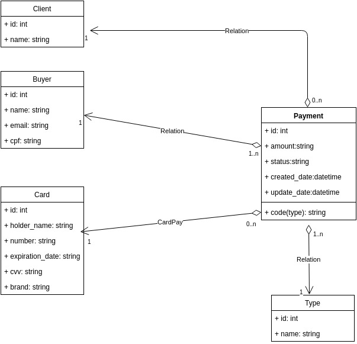

[](https://travis-ci.org/riquellopes/small-gateway)
[](https://coveralls.io/github/riquellopes/small-gateway?branch=master)

Small Gateway
=============

O small gateway é uma proposta simples ao grande universo de como realmente funciona o fluxo de captura de valores de um cartão ou geração de boleto.

#### Como iniciar a aplicação:
Para utilizar a aplicação é necessário possuir [docker](https://docs.docker.com/install/) e [docker-compose](https://docs.docker.com/compose/install/) na máquina. Para montar a aplicação siga os passos a baixo:

```sh
 $ make install # Builda o container e instala todas as dependências do app.
 $ make up # Levanta a aplicação na porta 5000. Para acessar o serviço: http://localhost:5000/

 $ make test # Executa todos os testes na aplicação
 or
 $ make test path={CAMINHO_DO_ARQUIVO} # Executa um teste especifico. Ex: make test path=test_api_boleto.py
```

#### Como realizar um pagamento:
A aplicação possui [swagger](https://swagger.io/) com todos os endpoints mapeados e os exemplos de request e response que um serviço pode ter.

#### Definições gerais sobre a aplicação:

##### Stack:

Para criar o gateway de pagamento o framework selecionado foi a [microframework](https://en.wikipedia.org/wiki/Microframework)[Flask](http://flask.pocoo.org/)+[Python](https://www.python.org/). Ela atende
a demanda proposta, por sua simplicidade e por possuir várias [extenções](http://flask.pocoo.org/extensions/) que facilitam o processo de construção. O [flask](http://flask.pocoo.org/) possue alguns [modelos](http://exploreflask.com/en/latest/organizing.html#single-module) de como você
pode organizar o seu código, para faciliar o processo de construção. E eu fiz uma mescla disso, transformando em pacotes apenas o que possuia uma complexidade muita alta de compreensão.


##### Banco de dados:
O banco útilizado nessa [poc](https://pt.wikipedia.org/wiki/Prova_de_conceito) foi o [sqlite](https://www.sqlite.org/index.html).


##### CI
O repositório está integrado com [travis](https://travis-ci.org/) e [coveralls](http://coveralls.io/).

##### Modelo:

